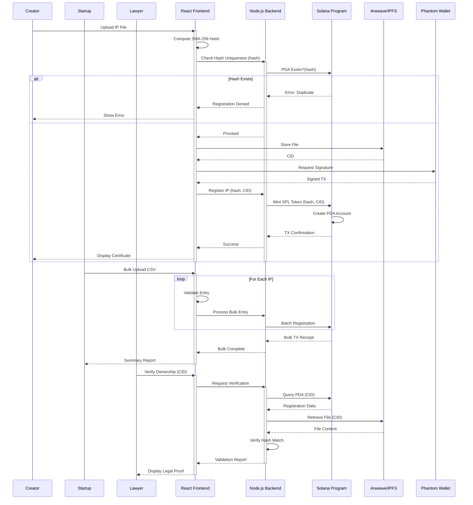
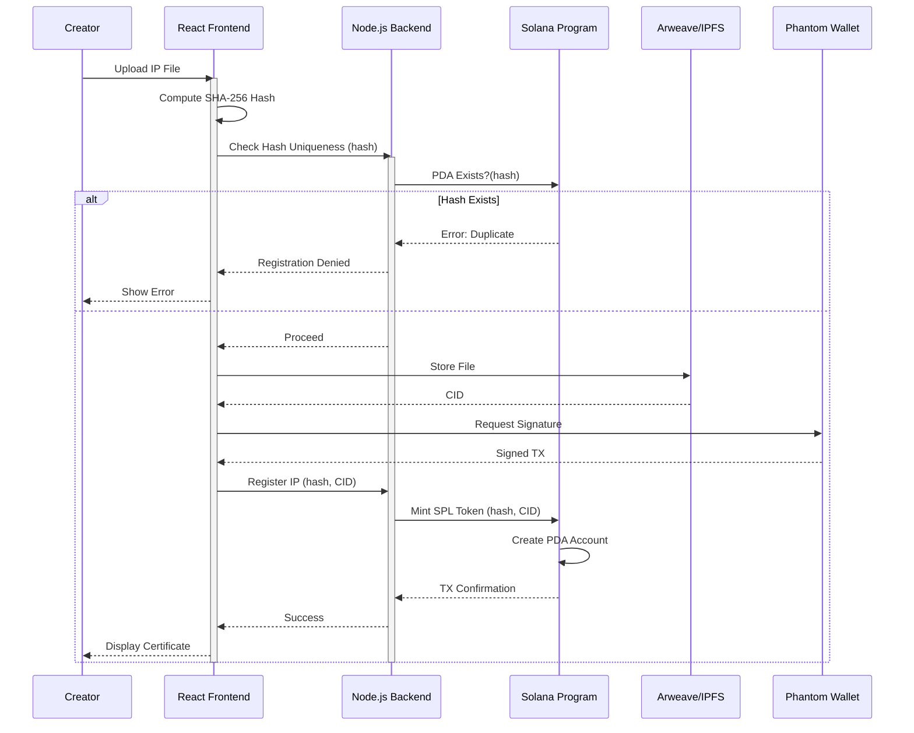
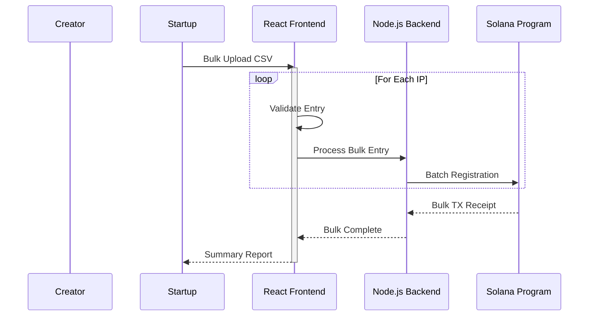
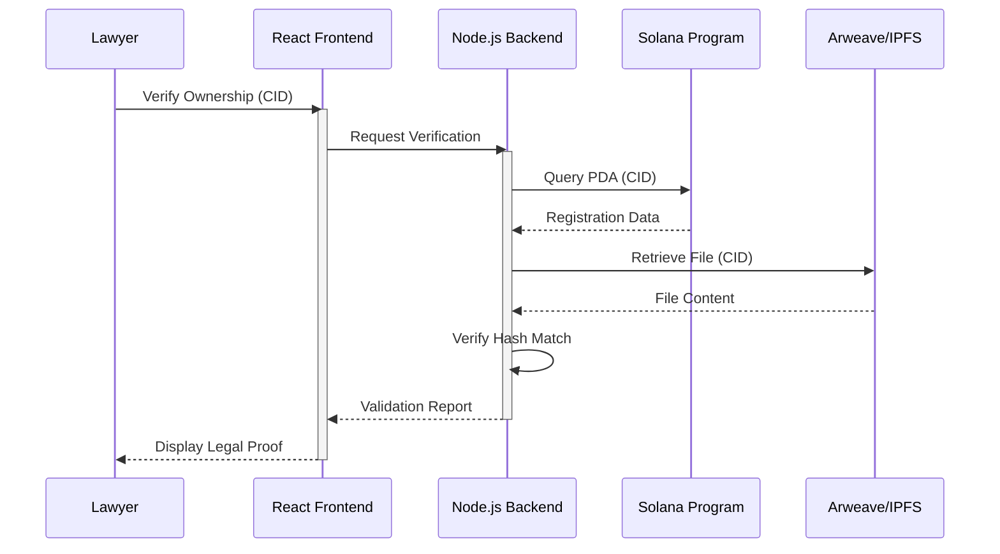

# IPRChain - Onchain Intellectual Property Registry

IPRChain is a decentralized platform on the Solana blockchain designed to enable individuals and organizations to securely register and verify ownership of their intellectual property and copyrights.

By utilizing blockchain’s immutability and transparency, IPRChain ensures that all processes are permanently recorded on-chain, providing indisputable proof of ownership.

The platform simplifies the intellectual property registration process, making it accessible globally and eliminating the reliance on traditional centralized organizations. Users will receive digital proof of their ownership, enhancing trust and reducing disputes in intellectual property claims.

## Architecture

<!--# -->

#### Core Components

1. **IP Registry**
   - Creator registers an IP, the protocol generates a unique identifier (IP ID).
   - This identifier is stored in the IP Registry (a PDA).
   - Metadata (title, creator, description, rights, etc.) is hashed and stored on-chain, while the full content can be stored off-chain (e.g., IPFS, Arweave).
   - The registered IP is linked to NFTs to represent verifiable ownership.
2. **Licensing**
   - The creator defines licensing terms (usage rights, royalty rules).
   - These licenses define:
     - Who can use the IP (public, private, specific entities)
     - How it can be used (commercial vs. non-commercial)
     - Revenue-sharing terms (percentage of royalties, upfront fees, etc.)
   - Other users discover the IP according to the set terms.
   - A licensee accepts the license and pays the required fees.
   - The protocol grants access to the IP.
3. **Derivative Tracking System (out of scope)**
   - A licensee creates a derivative work, registering it on the protocol.
   - A new IP ID is generated but remains linked to the original work for attribution.
4. **Economic & Incentive Layer**
   - The derivative work is listed on a marketplace for sale.
   - The marketplace reports sales to the protocol.
   - The protocol’s revenue system calculates royalty splits.
   - Funds are automatically distributed to the original creator and new contributor(s).

### Sequence Diagram

#### General Overview

#### Creator

#### Startup

#### Laywer

<!--
[![](https://mermaid.ink/img/pako:eNqdVm1P2zAQ_iuWpUkgFTY6KE0-dCp9EUiwdRQYmvrFSq6NR2JnjkPpEP9957yHpF01f6hS-znf-e65x36ljnSB2jSC3zEIB8acrRQLFoLgCJnS3OEhE5qMFDAtVXNhrvFPHDYXrtl6Ay0GUyWFBuESFpFbYE4508ReMOcpg37FQI9_RflUSyDSZ4IZaPY1U7L9LEO1BvYMBpp9fryaTedN4MzDXxkYYP75g_k-6IVIwR8-5InBo6x4pBXTXAoy9eU6RWTLR4NBfkqb3Ie-ZC65mpEp9yHFYR74M9PwLhlm5DO1PUYyCGOEzy-HR92zHrlkkddqkuULLTxwnhIcuRfclBuiiBx4OHFYWhZx1PKcj2wSt01zbJPZeEgmL3jy6Mv7rZLtfJ26TDH1RTPSfY6qgU6Uksom4zj0uYOhNI3yMGoZqRVgDIKD27QsEoOmWWlsMvfkOvVaNwA_2tc5cs2BnQ4Hg4xr6A-9QqX21ZGB6ruPrsY7d87IaXKAdY2wF_hKMB2rFgcZtu7A4MEld4873RQVSlMNylA4qXrHhHi4PVclX264adXZNbmTuLLbOuNGaZxUDBLODR1HxkLvRai7R2wXseQqSMixZ0nnseNgh-zJoTGPQp9tyAhQPpYtvK31kgvtfVaZL3WgkJqL2H_KxaNUmEyAa7FXkaP5wz8lxpcyJFNUsQlzPKxqPfRWAXpgPnfNbhOh1WarQVGEpENQcJLQWmyaVLlgGoOptnVpUYu-peSJF6z7LTjAwwpNWkudoI2iorRDi4qaoNIsG1oEAVMb3DmUSu9TtgdQKSPqN0N6P9ZzapAb8m0tQEUeD8lB2Rj7XRCVFk2VoOr8_1X-ewx4ZNN3B81WbUl_XYuZZtscFJp4C1pxeE5lsc1LRRgLNwl2lBxeb_NQgLPkJrfRjaFWu0Ubyc0pqvXe1cLviZOWuRSIa1gx33SDXG4lD-3QAFCtuItPs1cDW1DtQQALauOnC0sW-3pBF-INoSzWcr4RDrW1iqFDlYxXHrWXDK-vDo1D06XZuy6H4Ovmp5TVv9R-pS_U7nWP--f9z9aJdWadW32r16EbanePra7VO-13T0-6n84sq_fWoX8S-5MOBZejAt6k78jkOfn2F6m0K8s?type=png)](https://mermaid.live/edit#pako:eNqdVm1P2zAQ_iuWpUkgFTY6KE0-dCp9EUiwdRQYmvrFSq6NR2JnjkPpEP9957yHpF01f6hS-znf-e65x36ljnSB2jSC3zEIB8acrRQLFoLgCJnS3OEhE5qMFDAtVXNhrvFPHDYXrtl6Ay0GUyWFBuESFpFbYE4508ReMOcpg37FQI9_RflUSyDSZ4IZaPY1U7L9LEO1BvYMBpp9fryaTedN4MzDXxkYYP75g_k-6IVIwR8-5InBo6x4pBXTXAoy9eU6RWTLR4NBfkqb3Ie-ZC65mpEp9yHFYR74M9PwLhlm5DO1PUYyCGOEzy-HR92zHrlkkddqkuULLTxwnhIcuRfclBuiiBx4OHFYWhZx1PKcj2wSt01zbJPZeEgmL3jy6Mv7rZLtfJ26TDH1RTPSfY6qgU6Uksom4zj0uYOhNI3yMGoZqRVgDIKD27QsEoOmWWlsMvfkOvVaNwA_2tc5cs2BnQ4Hg4xr6A-9QqX21ZGB6ruPrsY7d87IaXKAdY2wF_hKMB2rFgcZtu7A4MEld4873RQVSlMNylA4qXrHhHi4PVclX264adXZNbmTuLLbOuNGaZxUDBLODR1HxkLvRai7R2wXseQqSMixZ0nnseNgh-zJoTGPQp9tyAhQPpYtvK31kgvtfVaZL3WgkJqL2H_KxaNUmEyAa7FXkaP5wz8lxpcyJFNUsQlzPKxqPfRWAXpgPnfNbhOh1WarQVGEpENQcJLQWmyaVLlgGoOptnVpUYu-peSJF6z7LTjAwwpNWkudoI2iorRDi4qaoNIsG1oEAVMb3DmUSu9TtgdQKSPqN0N6P9ZzapAb8m0tQEUeD8lB2Rj7XRCVFk2VoOr8_1X-ewx4ZNN3B81WbUl_XYuZZtscFJp4C1pxeE5lsc1LRRgLNwl2lBxeb_NQgLPkJrfRjaFWu0Ubyc0pqvXe1cLviZOWuRSIa1gx33SDXG4lD-3QAFCtuItPs1cDW1DtQQALauOnC0sW-3pBF-INoSzWcr4RDrW1iqFDlYxXHrWXDK-vDo1D06XZuy6H4Ovmp5TVv9R-pS_U7nWP--f9z9aJdWadW32r16EbanePra7VO-13T0-6n84sq_fWoX8S-5MOBZejAt6k78jkOfn2F6m0K8s)
-->
